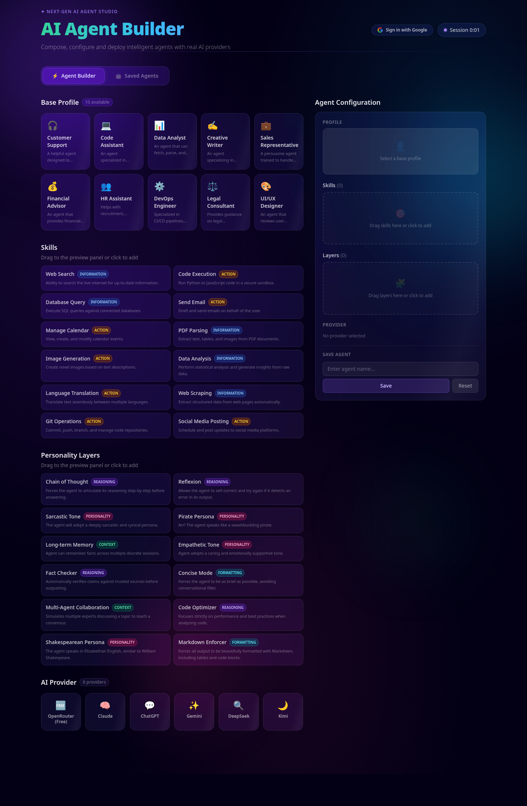
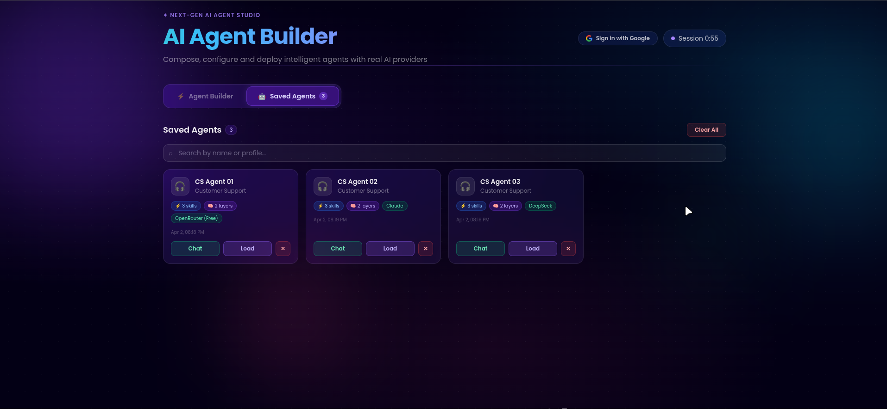
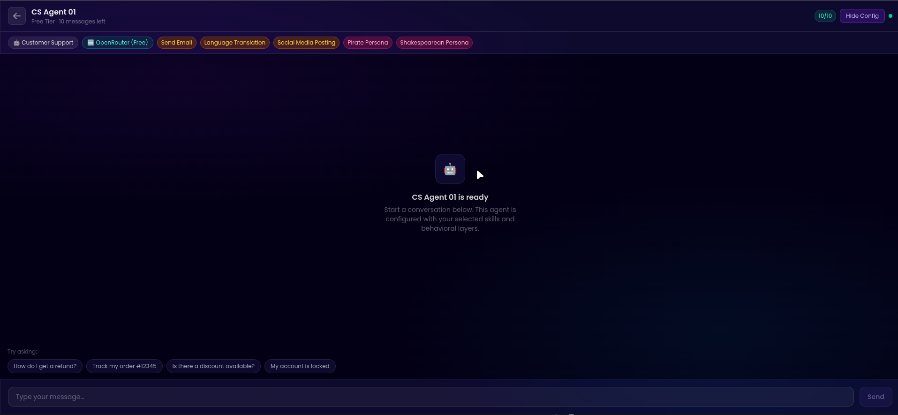
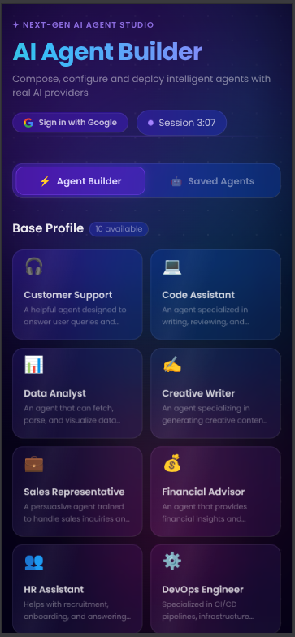
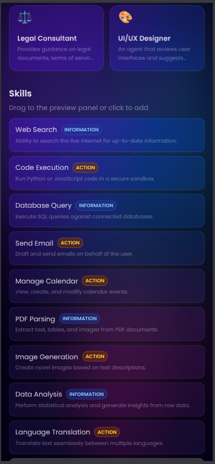
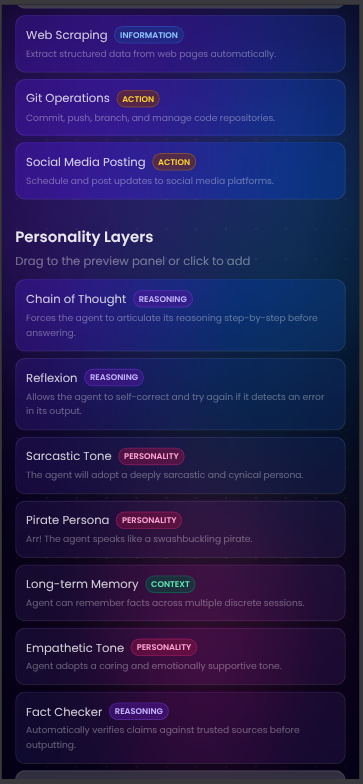
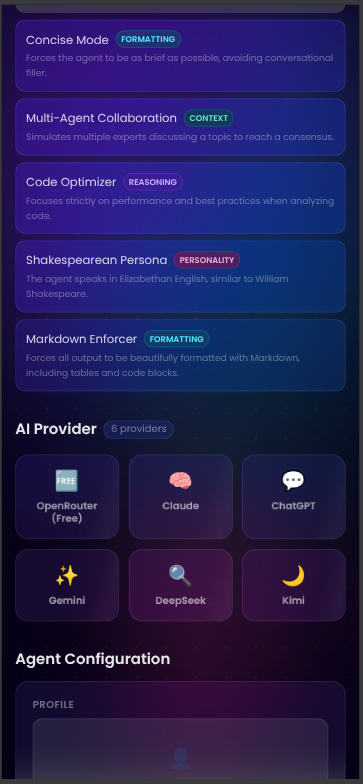
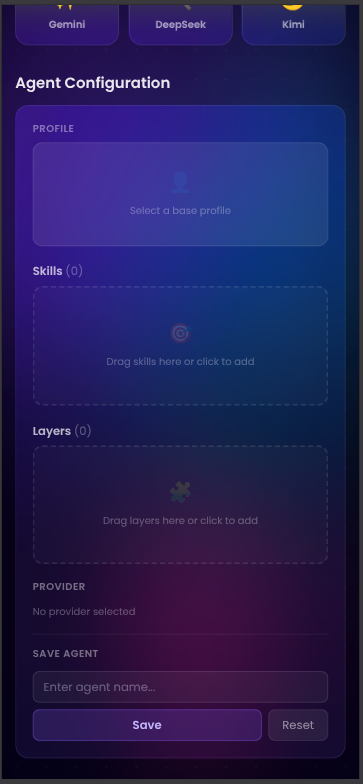
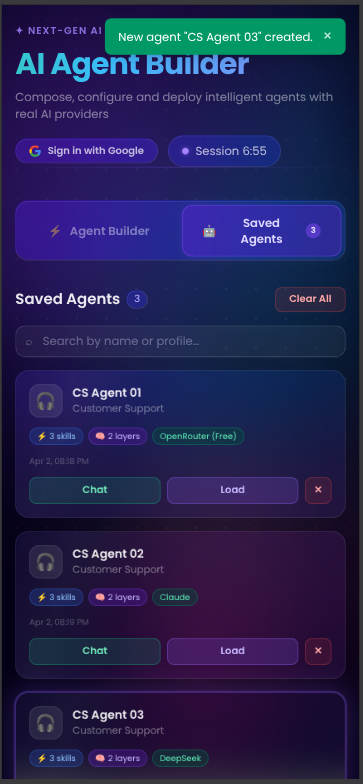
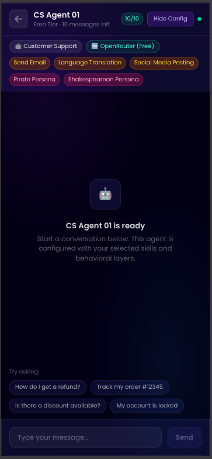

# AI Agent Builder

A Bun + React + TypeScript application for composing AI agents from reusable **profiles**, **skills**, and **behavioral layers**, then testing them in both simulated and real provider-backed chat.

This README is fully rewritten for the current codebase and includes:
- Complete local setup and run instructions
- Environment setup for a repository that does **not** commit `.env` files
- Architecture and technical decision breakdown
- UI screenshots from the running app

## UI Preview

### Desktop
#### 1) Builder tab


#### 2) Saved Agents tab


#### 3) Chat interface


### Mobile (iPhone 14 Pro Max)
#### 1) Builder - top section


#### 2) Skills section


#### 3) Personality layers (part 1)


#### 4) Personality layers + provider


#### 5) Configuration and save panel


#### 6) Saved Agents tab (2nd tab)


#### 7) Chat interface


## Tech Stack

- **Runtime/PM:** Bun
- **Frontend:** React 19 + TypeScript
- **Build tool:** Vite 8
- **Styling:** Tailwind CSS v4 + custom CSS design system
- **DnD:** `@dnd-kit`
- **Persistence:** Browser `localStorage` + optional Google Drive `appDataFolder`
- **AI chat:** Browser-direct provider streaming (OpenRouter, OpenAI, Anthropic, Gemini, DeepSeek, Kimi)

## Prerequisites

- Bun `>= 1.1`
- Node.js `>= 20` (recommended for tooling compatibility)
- Modern browser (Chrome/Firefox/Edge)

Verify:

```bash
bun --version
node --version
```

## Quick Start (Bun)

```bash
# 1) Install dependencies
bun install

# 2) Create local env file
cp .env.example .env.local

# 3) Start dev server
bun run dev --host 127.0.0.1 --port 5173
```

Open `http://localhost:5173`.

If `5173` is busy, Vite will auto-select another port (for example `5174`) and print it in terminal.

## Environment Setup (No Env Files Committed)

This project intentionally relies on **local-only env files**. Do not commit your secrets.

### 1) Use the template

```bash
cp .env.example .env.local
```

### 2) Fill required values in `.env.local`

```bash
# Needed for OpenRouter free-tier live chat
VITE_OPENROUTER_API_KEY=your_openrouter_api_key_here

# Google OAuth Client ID (public client ID, NOT a client secret)
VITE_GOOGLE_CLIENT_ID=your-client-id.apps.googleusercontent.com

# true  => use VITE_GOOGLE_CLIENT_ID directly
# false => ask end user for their own client ID via setup modal
VITE_USE_ENV_CREDENTIALS=true
```

### Env Variable Reference

| Variable | Required | Purpose |
|---|---|---|
| `VITE_OPENROUTER_API_KEY` | Required for OpenRouter free live chat | Used by browser-side OpenRouter streaming client |
| `VITE_GOOGLE_CLIENT_ID` | Required if `VITE_USE_ENV_CREDENTIALS=true` | Google Identity Services OAuth client ID |
| `VITE_USE_ENV_CREDENTIALS` | Yes | Controls whether Google client ID comes from env or user modal input |

### Google OAuth Setup Notes

When using Google Drive sync, create a **Google OAuth Web Client** and set allowed JavaScript origins (for local dev usually `http://localhost:5173` and/or `http://127.0.0.1:5173`).

Important:
- Never put `client_secret` in frontend env files.
- This app uses GIS token flow and only stores access token in memory.

## Available Scripts (Bun)

```bash
bun run dev      # Vite dev server
bun run build    # TypeScript build + Vite production build
bun run lint     # ESLint
bun run preview  # Preview production build
```

## Project Structure

```text
src/
  components/
    auth/        # Google auth + consent/setup modals
    builder/     # Builder tab, preview, save/update form
    chat/        # Simulated/live chat overlays + modals
    layers/      # Layer pool + selected/reorder UI
    layout/      # App header
    profile/     # Profile grid/cards
    provider/    # Provider grid/cards
    saved/       # Saved agents list/cards + filters + Drive actions
    shared/      # DnD wrapper, toasts, error boundary, skeleton, etc.
  hooks/
    useAgentData.ts       # Fetches public/data.json once
    useAgentBuilder.ts    # Builder state + reorder logic
    useSavedAgents.ts     # localStorage CRUD for saved agents
    useChatPlayground.ts  # Simulated chat flow
    useLiveChat.ts        # Real provider streaming flow
    useGoogleAuth.ts      # GIS token flow
    useGoogleDrive.ts     # Drive appDataFolder read/write
  lib/
    constants.ts            # Providers, models, UI color maps, limits
    system-prompt-builder.ts# Composes final prompt from profile/skills/layers
    provider-clients.ts     # Streaming adapters for each provider
    simulation-engine.ts    # Simulated response generation + layer transforms
    response-templates.ts   # Profile templates, suggested prompts, skill cards
public/
  data.json       # Base profiles, skills, layers catalog
  skills/*.md     # Prompt fragments for skills
  layers/*.md     # Prompt fragments for behavioral layers
docs/ui/          # README screenshot assets
```

## Architecture

### 1) High-Level Architecture

- **Single-page React app** with `App.tsx` as composition root.
- **Feature-oriented component folders** for builder, saved list, chat, auth, etc.
- **Custom hooks own stateful business logic**, components stay mostly presentational.
- **Static seed data** is loaded from `public/data.json`.
- **Prompt assembly is modular** through `public/skills/*.md` and `public/layers/*.md`.
- **Two chat engines**:
  - Simulated engine (`useChatPlayground` + `simulation-engine.ts`)
  - Real streaming engine (`useLiveChat` + `provider-clients.ts`)

### 2) State Boundaries

### UI/Session State
Managed in `App.tsx` + feature hooks:
- active tab
- currently edited agent
- active chat overlays
- modal visibility states
- recently saved highlight

### Builder State (`useAgentBuilder`)
- selected profile
- ordered selected skills
- ordered selected layers
- selected provider
- agent name
- loaded agent id (edit mode)

### Persistence State (`useSavedAgents` + `useLocalStorage`)
- durable `savedAgents` in browser `localStorage`
- CRUD operations with immutable updates
- IDs via `crypto.randomUUID()`

### Cloud Sync State (`useGoogleDrive`)
- sync/load status
- last synced timestamp
- sync errors
- Google Drive file stored in `appDataFolder`

### 3) Data Flow

### Boot
1. `useAgentData` fetches `/data.json` on mount.
2. Builder and saved state hooks initialize.
3. Optional Google auth initializes (if client ID available).

### Build + Save Agent
1. User selects profile/skills/layers/provider.
2. `useAgentBuilder` updates immutable state.
3. `SaveAgentForm` triggers `onSave`/`onUpdate`.
4. `useSavedAgents` writes to `localStorage`.

### Chat Start
1. User clicks Chat on saved card.
2. Routing by provider:
   - `OpenRouter (Free)` -> live chat directly
   - Paid provider -> API key modal -> live chat
   - Empty provider fallback -> simulated chat

### Live Chat Pipeline
1. `useLiveChat.openChat()` builds system prompt using selected profile + markdown fragments.
2. `streamProviderResponse()` dispatches by provider adapter.
3. SSE chunks stream into assistant message in-place.
4. AbortController supports stop/cancel/close behavior.

### 4) Prompt Composition Design

`buildSystemPrompt()` composes the final system prompt from:
1. Base profile identity from `data.json`
2. Selected skill markdown files from `public/skills`
3. Selected layer markdown files from `public/layers`
4. Shared closing behavior guideline

This keeps behavioral instructions modular and reorderable without backend prompt templates.

### 5) Provider Integration Layer

`src/lib/provider-clients.ts` provides a unified async generator API over provider-specific endpoints/protocols:
- OpenRouter (OpenAI-compatible SSE)
- OpenAI Chat Completions SSE
- Anthropic Messages SSE format
- Gemini streamGenerateContent SSE format
- DeepSeek and Kimi OpenAI-compatible SSE

Common features:
- Provider-specific error normalization via `ProviderError`
- Shared SSE reader + parser helpers
- Per-provider default model mapping from `constants.ts`

### 6) Drag-and-Drop Interaction Model

`DndWrapper` centralizes `@dnd-kit` configuration:
- Pool -> selected drop behavior
- Selected list reorder behavior
- Keyboard + pointer sensors
- Drag overlay rendering

Skill and layer order is preserved and used in both preview and response behavior pipeline.

### 7) Styling System

- Tailwind v4 utilities + custom CSS theme tokens in `src/index.css`
- reusable classes for glassmorphism, neon borders, glow, shimmer, and motion
- responsive card-grid layout for profile/skills/layers/providers
- full-screen overlay chat experiences for simulated and live modes

## Technical Decisions (and Why)

1. **Custom hooks over global store**
- Chosen to keep ownership local and readable for this app size.
- Avoided extra dependency/state library overhead.

2. **Immutable updates everywhere**
- Prevents stale UI and mutation bugs in builder/saved agent flows.
- Enables predictable re-render behavior.

3. **Single fetch for static catalog data**
- `useAgentData` fetches once on mount.
- Avoids repeated network calls for fixed seed data.

4. **Modular prompt fragments in `public/`**
- Skills/layers are editable independently as markdown files.
- Improves maintainability and experimentation speed.

5. **Provider abstraction behind one streaming function**
- UI only depends on one interface (`streamProviderResponse`).
- Provider-specific logic is isolated in one module.

6. **Session-only API key handling for paid providers**
- API keys are collected in modal and kept in memory.
- Not persisted to localStorage by design.

7. **Google Drive `appDataFolder` for sync**
- Keeps synced data hidden from general Drive file list.
- Good balance between user ownership and privacy.

8. **Dual chat strategy (simulated + live)**
- Simulated mode supports demos/testing without external APIs.
- Live mode supports real provider behavior and streaming UX.

9. **Manual chunking in Vite build**
- Splits React and DnD vendor chunks to improve caching and load profile.

## How to Use the App

1. Open **Agent Builder** tab.
2. Pick a base profile.
3. Add skills and layers (drag or click; reorder in preview panel).
4. Pick an AI provider.
5. Save the agent.
6. Open **Saved Agents** tab.
7. Click **Chat** on any saved agent.
8. If provider requires key, enter API key in modal.
9. (Optional) Connect Google account and sync agents to Drive.

## Build & Quality Checks

Run before shipping:

```bash
bun run lint
bun run build
bun run preview
```

Manual checks recommended:
- drag/drop add + reorder for skills/layers
- create, update, delete, and search/filter saved agents
- simulated chat and live chat paths
- provider API key modal flow
- Google sign-in + sync/load flows

## Deployment Notes

- This is a client-side app (Vite static build).
- Production output is generated in `dist/`.
- Ensure production env variables are configured in hosting platform:
  - `VITE_OPENROUTER_API_KEY`
  - optional Google OAuth vars

## Known Constraints

- No backend proxy; provider APIs are called from browser.
- Free-tier path depends on valid OpenRouter env key.
- Payment/upgrade flow is currently a UX placeholder (`Coming Soon`).

## Troubleshooting

### App starts but chat fails for OpenRouter
- Verify `VITE_OPENROUTER_API_KEY` in `.env.local`.
- Restart dev server after env changes.

### Google sign-in does not appear
- Check `VITE_GOOGLE_CLIENT_ID` format.
- Verify authorized origins in Google Cloud Console.
- If using user-entered credentials mode, set `VITE_USE_ENV_CREDENTIALS=false`.

### Port already in use
- Start with another port:

```bash
bun run dev --host 127.0.0.1 --port 5174
```
